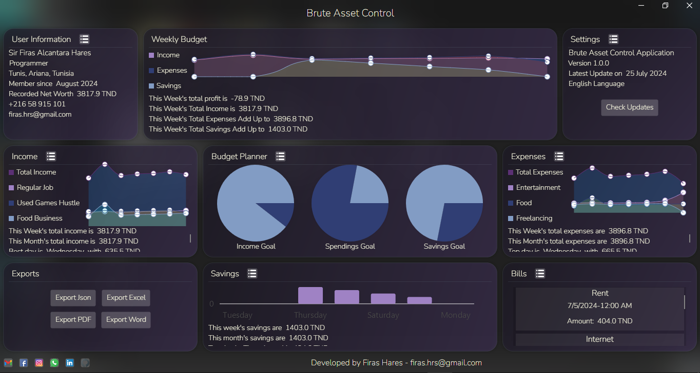
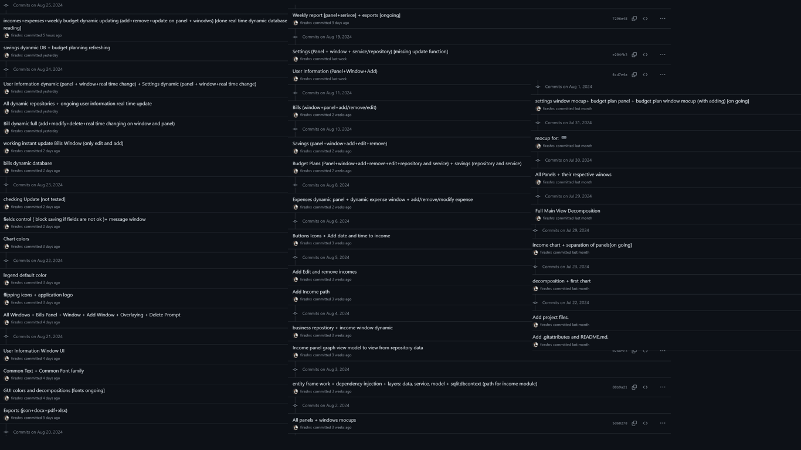

# Brute Asset Control

  

**Brute Asset Control** is a free desktop personal budgeting application designed to help you manage your finances efficiently. Whether you're tracking incomes, expenses, budget goals, or bills, Brute Asset Control has you covered. Developed using **C#** and **.NET 8**, with a focus on **Avalonia** and the **MVVM architecture**, it offers a robust and user-friendly experience. The application uses a local **SQLite database**, managed through **Entity Framework**, ensuring your data is both secure and easily accessible.

## Features

- **Incomes Management**: Track all sources of income with ease.
- **Expenses Tracking**: Keep a close eye on where your money is going.
- **Budget Goals**: Set and monitor your financial targets.
- **Bills Management**: Never miss a payment with bill tracking.
- **Local SQLite Database**: Secure and local data storage.
- **Entity Framework Integration**: Efficient database management.

## Tools & Techniques

The development of Brute Asset Control involved the use of several advanced tools and techniques, showcasing a deep understanding of modern software development practices:

- **C# and .NET 8**: Leveraging the power of the latest .NET framework for high performance and cross-platform support.
- **Avalonia UI Framework**: Utilizing Avalonia to create a rich, cross-platform user interface while adhering to the MVVM (Model-View-ViewModel) design pattern for a clean and maintainable codebase.
- **MVVM Architecture**: Implementing the MVVM architecture to separate business logic from UI code, ensuring a more organized and testable application structure.
- **SQLite Database**: Employing a local SQLite database to store user data securely and efficiently, ideal for desktop applications.
- **Entity Framework Core**: Using Entity Framework Core to manage database operations, providing an abstraction layer that simplifies data access while supporting LINQ queries.
- **Git Version Control**: Maintaining a detailed commit history over 34 days of development, with each commit reflecting meaningful progress and code refinement.

## Progress & Development

The development of Brute Asset Control was an intensive **34-day journey**, during which significant progress was made through a series of structured and focused commits. Each commit represents a step forward in the application's functionality, stability, and user experience.

This list of commits showcases the detailed work and dedication put into refining every aspect of the application, from initial setup to the final touches. Whether it was implementing core features, resolving bugs, or optimizing performance, each stage was meticulously documented to ensure transparency and continuous improvement.

## Screenshots

## Demo

Check out a video demo of Brute Asset Control on [YouTube](https://youtu.be/NHr0wy0w_NQ?si=2_ZDWvTz_r4Shys7).

## Installation

To install Brute Asset Control, simply download the installer from this repository and follow the standard installation process:

1. Download the installer file.
2. Run the installer.
3. Follow the on-screen instructions.

## License

This project is licensed under the terms of the license provided in the [LICENSE](./LICENSE.txt) file.

## Contact

For any inquiries or feedback, feel free to reach out:

- **Email**: [firas.hrs@gmail.com](mailto:firas.hrs@gmail.com)
- **Facebook**: [facebook.com/firas.hares.3](https://facebook.com/firas.hares.3)
- **LinkedIn**: [linkedin.com/in/firas-hares](https://www.linkedin.com/in/firas-hares/)

Thank you for using Brute Asset Control!

  

